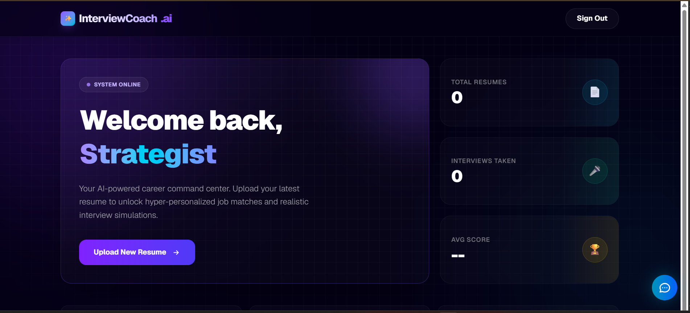
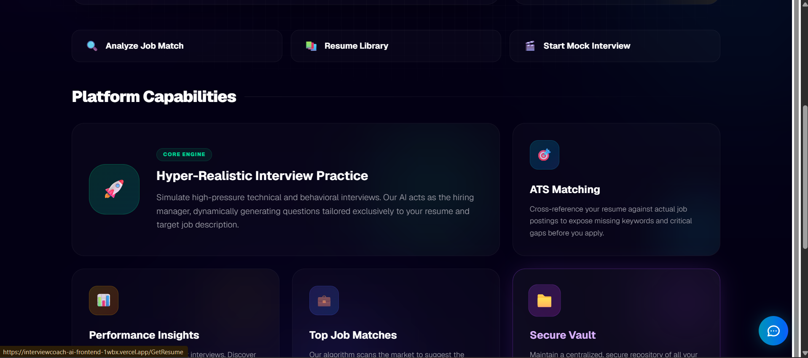
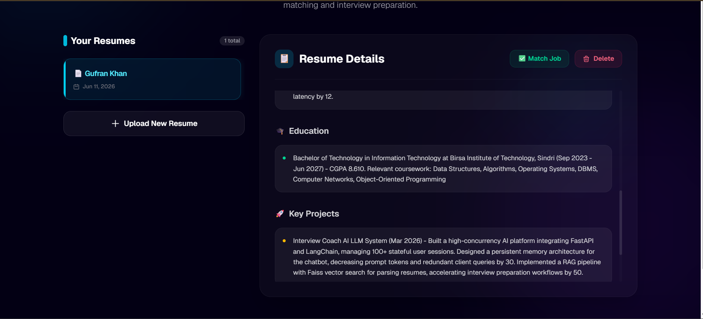
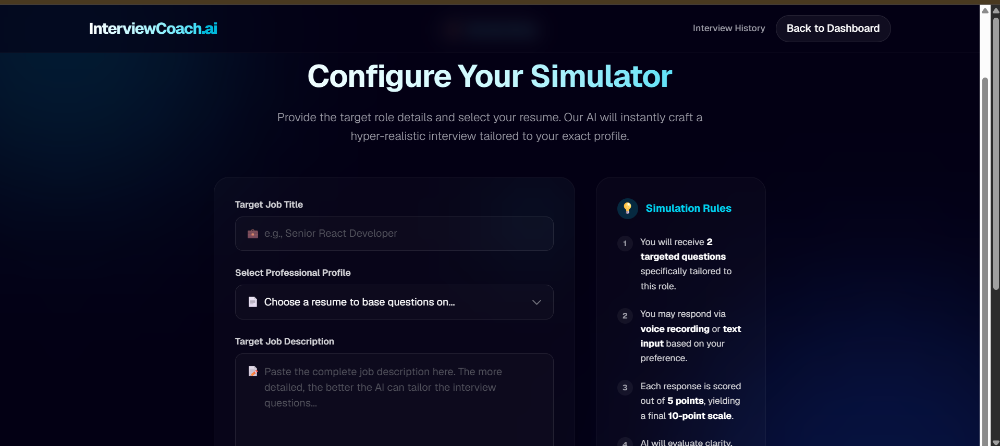
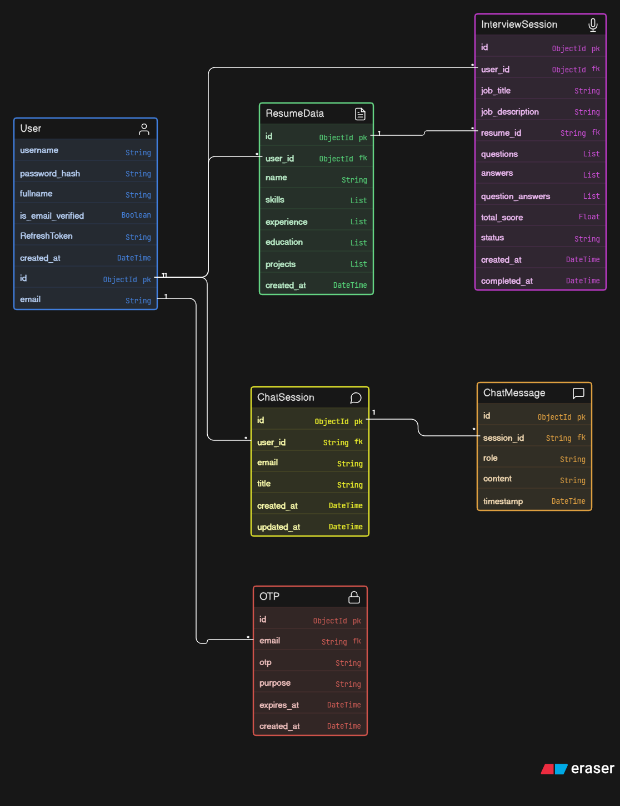
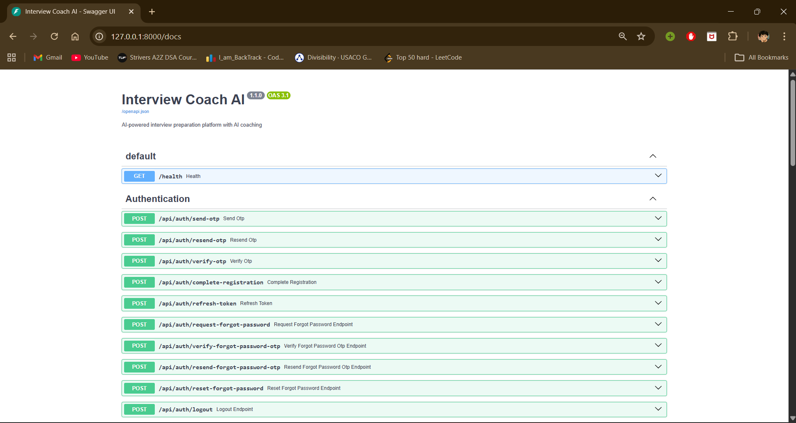
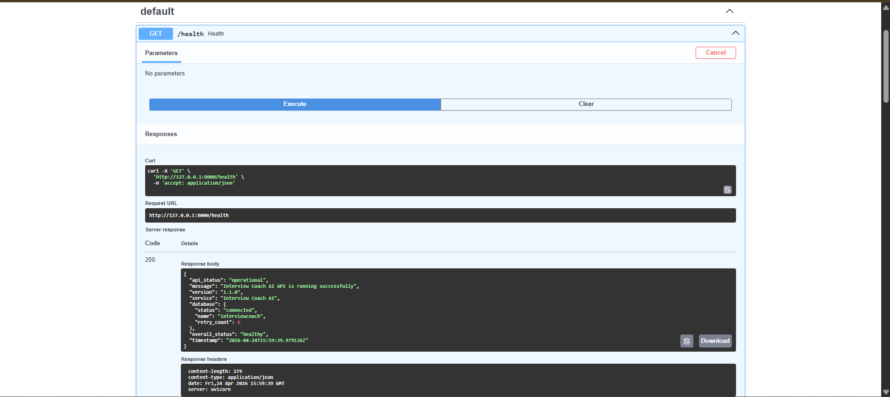

<h1 align="center">✨ Interview Coach AI</h1>

<div align="center">
  <p><strong>Your Ultimate AI-Powered Interview Preparation Platform</strong></p>
  <p>Interview Coach AI is a full-stack web application with a <strong>FastAPI backend</strong> and a sleek <strong>Next.js frontend</strong>, designed to help you land your dream job.</p>
</div>

---

## 🌟 What It Does

- 📄 **Upload & Analyze Resumes**: Extract key skills and experiences instantly.
- 🎯 **Generate Interview Questions**: Tailored questions based on your resume and target job.
- 💬 **AI Chat Coach**: Context-aware interview prep assistance.
- 💼 **Job Matching**: Compare your profile against job descriptions.
- 🔐 **Secure Auth**: OTP-based authentication flows and JWT token management.

---

## 🚀 Live Demo & API

Check out the live application here:
- 🌐 **Live Frontend Application:** [`https://interviewcoach-ai-frontend-1wbx.vercel.app/`](https://interviewcoach-ai-frontend-1wbx.vercel.app/)
- 🔌 **Production Backend API:** [`https://interviewcoach-ai-backend.onrender.com/`](https://interviewcoach-ai-backend.onrender.com/)
- 📖 **Interactive API Docs (Swagger):** [`https://interviewcoach-ai-backend.onrender.com/docs`](https://interviewcoach-ai-backend.onrender.com/docs)

*(Note: The frontend talks to the backend through the `NEXT_PUBLIC_API_URL` which must be set to the backend URL without a trailing slash.)*

---

## 📂 Project Structure

| Component | Description |
|-----------|-------------|
| [**app.py**](app.py) | Main FastAPI entrypoint |
| [**Frontend/**](Frontend) | Next.js frontend application |
| [**ResumeService/**](ResumeService) | Resume upload, parsing, and analysis logic |
| [**AuthService/**](AuthService) | Login, registration, OTP, and password reset |
| [**interviewService/**](interviewService) | Interview flow and dynamic question generation |
| [**chat_agent/**](chat_agent) | AI Chat assistant routes |
| [**JobMaching/**](JobMaching) | Match resume to job description |

---

## 🖼️ Screenshots & Architecture

### 💻 Frontend Previews
Take a look at our sleek Next.js user interface:

<div align="center">
  
  <br/><br/>

  
  <br/><br/>

  
  <br/><br/>
  
</div>

<br/>

### ⚙️ Backend Architecture & API
Here is our backend architecture and API documentation overview:

<div align="center">
  <h4>Database ER Diagram</h4>
  
  <br/><br/>
  <h4>FastAPI Swagger Documentation</h4>
  
  <br/><br/>
  <h4>Backend Health Endpoint</h4>
  
</div>

## 📚 Detailed Documentation

Check out the following dedicated docs for more in-depth information:

- [✨ All Features (ALL_FEATURES.md)](ALL_FEATURES.md)
- [🔌 Backend API (BACKEND_API.md)](BACKEND_API.md)
- [⚡ Quick Start Guide (QUICK_START.md)](QUICK_START.md)
- [🔗 Backend-Frontend Integration (BACKEND_FRONTEND_INTEGRATION.md)](BACKEND_FRONTEND_INTEGRATION.md)

---

## 🛠️ Local Setup

### 1. Backend Setup

```bash
# Create and activate virtual environment
python -m venv venv
# Windows
venv\Scripts\activate
# Mac/Linux
# source venv/bin/activate

# Install dependencies
pip install -r requirements.txt

# Start the server
uvicorn app:app --reload
```
> The backend runs locally at `http://localhost:8000`.

### 2. Frontend Setup

```bash
cd Frontend
npm install
npm run dev
```
> The frontend runs locally at `http://localhost:3000`.

---

## ⚙️ Environment Variables

### Backend (`.env`)

```env
DATABASE_URL=mongodb://localhost:27017/interviewcoach
DATABASE_NAME=interviewcoach
ACCESS_TOKEN_KEY=your_access_token_secret
REFRESH_TOKEN_KEY=your_refresh_token_secret
ALGORITHM=HS256
ACCESS_TOKEN_EXPIRE_SECONDS=3600
REFRESH_TOKEN_EXPIRE_SECONDS=604800
GROQ_API_KEY=your_groq_api_key
HF_TOKEN=your_hugging_face_token
GMAIL_USER=your_email@gmail.com
GMAIL_APP_PASSWORD=your_gmail_app_password
CORS_ORIGINS=http://localhost:3000,http://localhost:3001,https://interviewcoach-ai-backend.onrender.com
MAX_FILE_UPLOAD_SIZE=10485760
```

### Frontend Deployment on Vercel (`.env.local`)

```env
NEXT_PUBLIC_API_URL=https://interviewcoach-ai-backend.onrender.com
BACKEND_URL=https://interviewcoach-ai-backend.onrender.com
```

---

## ☁️ Deployment

### Frontend on Vercel
- Root directory: `Frontend`
- Framework: Next.js
- Set the frontend env vars above pointing to the deployed backend.

### Backend on Render
- Root directory: *repo root*
- Build command: `pip install -r requirements.txt`
- Start command: `uvicorn app:app --host 0.0.0.0 --port $PORT`

---

## 📝 Notes

- The backend heavily leverages **MongoDB** and **Groq**.
- Please keep the frontend and backend deployed as separate services for scalability.

---
