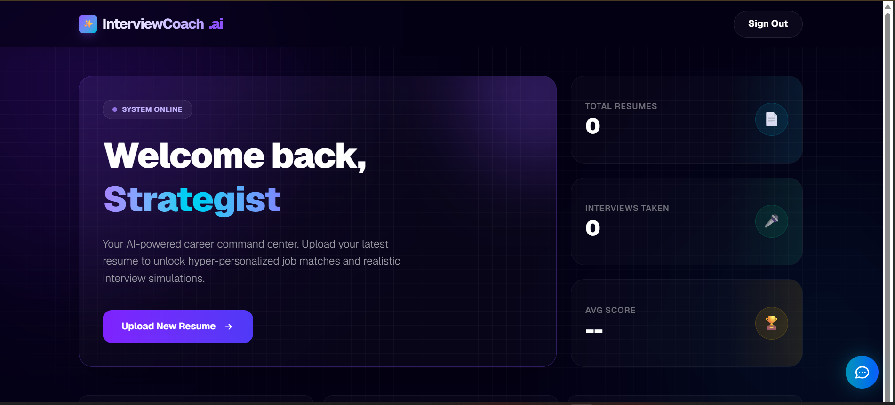
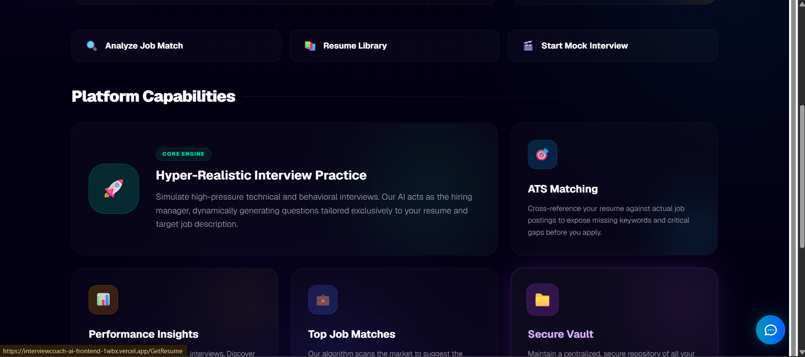
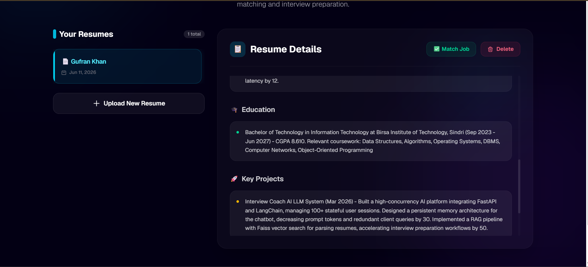
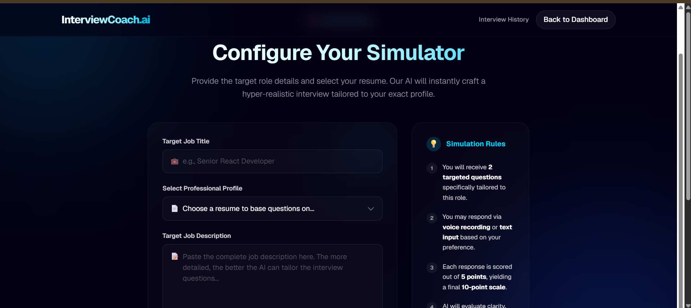
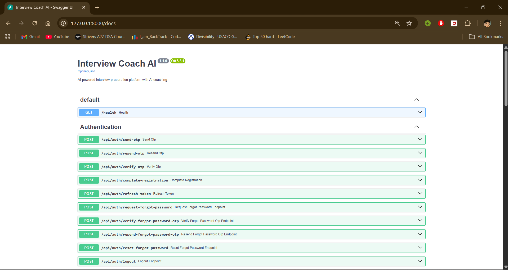
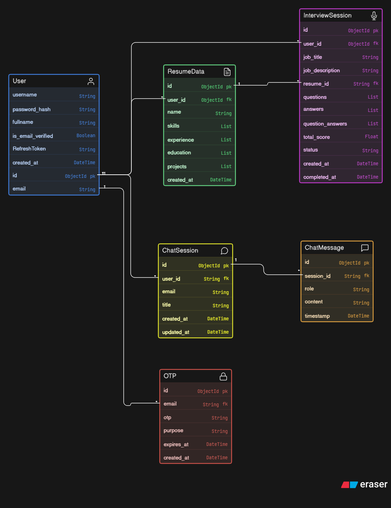

<h1 align="center">
  
  <br>
  Interview Coach AI
</h1>

<div align="center">
  <p><strong>Your Ultimate AI-Powered Interview Preparation Platform</strong></p>
  
  [](https://interviewcoach-ai-frontend-1wbx.vercel.app/)
  [](https://interviewcoach-ai-backend.onrender.com/docs)
  [](https://mongodb.com/)
  [](https://groq.com/)
  
  <p>Interview Coach AI is a full-stack web application with a <strong>FastAPI backend</strong> and a sleek <strong>Next.js frontend</strong>, designed to help you land your dream job by simulating hyper-realistic technical and behavioral interviews.</p>
</div>

---

## 🚀 Live Demo & API Access

Experience the platform live right now!

| Component | Live URL |
| :--- | :--- |
| 🌐 **Live Frontend Demo** | [**interviewcoach-ai-frontend-1wbx.vercel.app**](https://interviewcoach-ai-frontend-1wbx.vercel.app/) |
| ⚙️ **Backend API (Health)** | [**interviewcoach-ai-backend.onrender.com**](https://interviewcoach-ai-backend.onrender.com/) |
| 📚 **Swagger API Docs** | [**interviewcoach-ai-backend.onrender.com/docs**](https://interviewcoach-ai-backend.onrender.com/docs) |
| 📄 **ReDoc API Docs** | [**interviewcoach-ai-backend.onrender.com/redoc**](https://interviewcoach-ai-backend.onrender.com/redoc) |

*(Note: The frontend talks to the backend through the `NEXT_PUBLIC_API_URL`. Never include a trailing slash at the end of the URL to prevent 404 double-slash errors.)*

---

## ✨ Core Features

- 📄 **Upload & Analyze Resumes**: Extract key skills and experiences instantly using advanced parsing.
- 🎯 **ATS Job Matching**: Compare your profile against job descriptions to expose missing keywords.
- 🎤 **Mock Interviews**: Dynamically tailored questions based exclusively on your resume and target job.
- 🤖 **AI Chat Coach**: Context-aware interview prep assistance powered by Groq.
- 📈 **Performance Insights**: Review graded reports to discover where your STAR method fell short.
- 🔒 **Secure Auth**: OTP-based authentication flows and JWT token management (Powered by Resend API).
- 🎨 **Beautiful UI**: Premium dashboard powered by Next.js, TailwindCSS, and Lucide React.

---

## 🏗️ Project Architecture

| Component | Description |
|-----------|-------------|
| 🚀 [**app.py**](app.py) | Main FastAPI entrypoint |
| 💻 [**Frontend/**](Frontend) | Next.js frontend application |
| 📄 [**ResumeService/**](ResumeService) | Resume upload, parsing, and analysis logic |
| 🔐 [**AuthService/**](AuthService) | Login, registration, OTP, and password reset |
| 🎤 [**interviewService/**](interviewService) | Interview flow and dynamic question generation |
| 🤖 [**chat_agent/**](chat_agent) | AI Chat assistant routes |
| 🎯 [**JobMaching/**](JobMaching) | Match resume to job description |

---

## 📸 Screenshots

### 💻 Frontend User Interface
<div align="center">
  
  <br/><br/>
  
  <br/><br/>
  
  <br/><br/>
  
</div>

<br/>

### ⚙️ Backend & API
<div align="center">
  
  <p><i>FastAPI Swagger Documentation</i></p>
  <br/>
  
  <p><i>Database ER Diagram</i></p>
</div>

---

## 📚 Detailed Documentation

Dive deeper into the system architecture and API definitions:
- 🌟 [**All Features Guide** (ALL_FEATURES.md)](ALL_FEATURES.md)
- 🔌 [**Backend API Reference** (BACKEND_API.md)](BACKEND_API.md)
- 🚀 [**Quick Start Guide** (QUICK_START.md)](QUICK_START.md)
- 🔗 [**Backend-Frontend Integration** (BACKEND_FRONTEND_INTEGRATION.md)](BACKEND_FRONTEND_INTEGRATION.md)

---

## 💻 Local Development

### 1. Backend Setup

```bash
# Create and activate virtual environment
python -m venv venv
venv\Scripts\activate   # Windows
# source venv/bin/activate # Mac/Linux

# Install dependencies
pip install -r requirements.txt

# Start the server (runs on http://localhost:8000)
uvicorn app:app --reload
```

### 2. Frontend Setup

```bash
cd Frontend
npm install
npm run dev
# The frontend runs locally at http://localhost:3000
```

---

## 🔑 Environment Variables

### Backend (`.env`)
```env
DATABASE_URL=mongodb://localhost:27017/interviewcoach
DATABASE_NAME=interviewcoach
ACCESS_TOKEN_KEY=your_access_token_secret
REFRESH_TOKEN_KEY=your_refresh_token_secret
ALGORITHM=HS256
ACCESS_TOKEN_EXPIRE_SECONDS=3600
REFRESH_TOKEN_EXPIRE_SECONDS=604800
GROQ_API_KEY=your_groq_api_key
HF_TOKEN=your_hugging_face_token
RESEND_API_KEY=your_resend_api_key_here
CORS_ORIGINS=http://localhost:3000,http://localhost:3001,https://interviewcoach-ai-backend.onrender.com
MAX_FILE_UPLOAD_SIZE=10485760
```

### Frontend (`Frontend/.env.local`)
```env
NEXT_PUBLIC_API_URL=https://interviewcoach-ai-backend.onrender.com
BACKEND_URL=https://interviewcoach-ai-backend.onrender.com
# IMPORTANT: Never include a trailing slash (/) at the end of the API URLs!
```

---

## ☁️ Deployment

- **Frontend:** Deploy the `Frontend` directory to **Vercel** as a Next.js project. Ensure environment variables are set correctly without trailing slashes.
- **Backend:** Deploy the root directory to **Render** using the build command `pip install -r requirements.txt` and start command `uvicorn app:app --host 0.0.0.0 --port $PORT`.

---
<div align="center">
  <i>Built with ❤️ to help you ace your next interview.</i>
</div>
